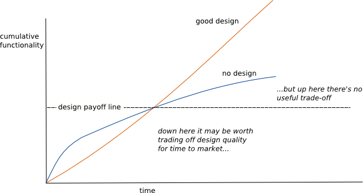
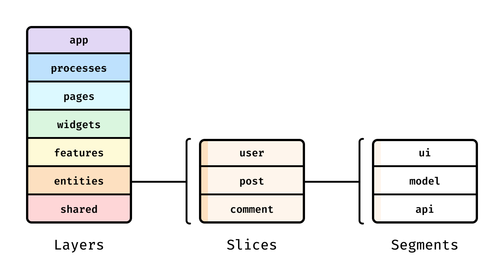
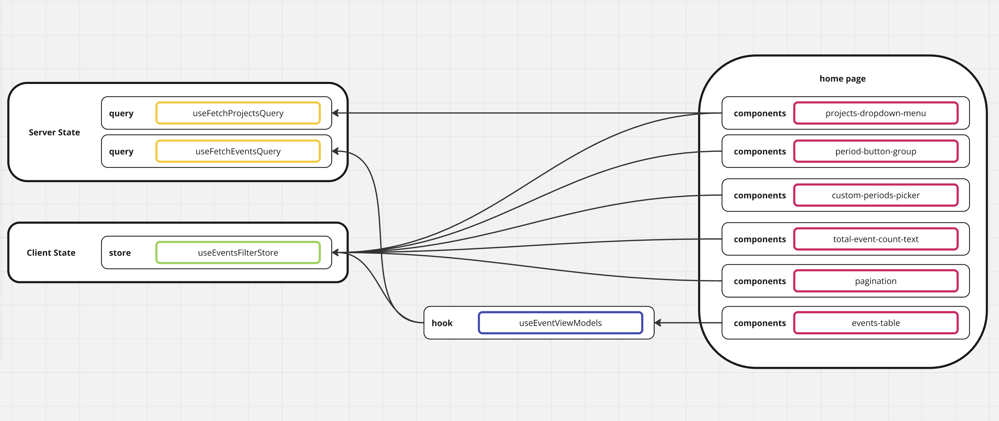

# 프로젝트 설명

## 기술스택 및 방법론 선택 사유

### package manager - pnpm
- Global 저장소에 install되고 symbolic link로 참조하는 방식.
  - monorepo에 가장 최적화 된 디펜던시 관리 방식
- non-flat node_modules directory no hoist no phantom dependency issue
- 병렬 install 지원
  - pnpm is up to 2x faster than npm

### lint - commitlint, husky
- 일관된 커밋메세지는 히스토리 파악을 포함, 팀원과의 협업에 많은 이점이 있습니다. 따라서 가장 널리 사용되는 [commitlint](https://commitlint.js.org/)를 본 과제에 적용하였습니다.
- 커밋 컨벤션 확인 스크립트를 pre-commit hook에 추가하기 위하여, husky를 추가로 install하였습니다.

### format - prettier
- 일관된 코드 포맷 또한 협업에 많은 이점을 가져다 주기 때문에, prettier를 적용하였습니다.
- 현 과제에는 제가 그동안 사용해 온 rule을 적용하였지만, .prettierrc에 정의된 rule들은 기본적으로 팀원들과의 합의를 통해 정합니다.
- 개개인의 스타일은 존중하되, 커밋상에서는 팀내 합의된 format을 남기기 위해 pre-commit hook에 format 체크 기능을 추가하였습니다.


### Architecture - [FSD](https://feature-sliced.design/)
> Good Software Design에 대한 Martin Fowler의 글과 다음 그래프에 대해 많이 공감하는 편입니다.


프로젝트의 폴더 구조를 잡는 일은 Good Software Design의 시작점이자 코드의 방향을 잡는 키 역할을 하기 때문에 매우 중요한데요,
그간의 경험을 통해 기술 중심보다는 기능 단위로 코드를 묶는 것이 협업시 Conflict를 덜 유발하고 Side Effect를 줄이는데 많은 이점이 있다는 사실을 확인했던 것 같습니다.


#### **기술 중심의 프로젝트 예시**
```bash
src/
  ├── assets/           icon, images, translations, ...
  ├── components/       React components ...
  ├── contexts/         React contexts ...      
  ├── hooks/            React hooks ...
  ├── stores/           Store data for client side ...
  ├── styles/           css, scss css-in-js fragments ...
  ├── constants/  
  ├── utils/      
  ├── App.tsx
  └── package.json      
```
#### **기능 중심의 프로젝트 예시**
```bash
src/
  ├── features/
  │    ├── auth/
  │    ├── profile/
  │    │    ├── api/
  │    │    ├── components/
  │    │    ├── contexts/
  │    │    ├── stores/
  │    │    ├── hooks/
  │    │    ├── models/
  │    │    └── ...
  │    ├── dashboard/
  │    └── ...
  ├── shared/
  │    ├── utils/
  │    ├── components/
  │    ├── libs/
  │    └── ...    
  ├── App.tsx
  └── package.json      
```

다만 위 폴더 구조는 feature간에 상하관계가 없다보니 서로를 상호참조 하게 되는 단점이 존재하는데요, Feature-Sliced Design(FSD)는 app, pages, widgets, features, entities, shared라는 layer를 두어 위에서 아래로 단방향 참조를 유도하는 아키텍쳐 방법론입니다. 

그리고 횡축으로는 Layer, Slice, Segment라는 3개의 단계를 두어 좀 더 체계적인 프로젝트 구조를 제시하는데요,



기능 중심의 프로젝트의 장점에 덧붙여 아래와 같은 장점들이 존재하여, 빠르게 변화하는 비즈니스 요구사항에 유연하게 대처 가능한 방법론이라 생각됩니다.
1. 단방향 의존성 규칙이 있어서 유지보수성이 높고
2. 오픈소스 아키텍쳐 디자인이라 확장성이 있고 linter, cli과 같은 툴이 존재한다는 점 
3. 초기 프로젝트에서는 필요한 계층만 도입해서 점진적으로 적용 가능

--- 
본 기술과제는 한 화면에 대한 요구사항만 있기 때문에 오버 엔지니어링일텐데요, FSD 소개 겸 일반적으로는 웹앱에 여러 페이지들이 존재하기에 본 프로젝트에 FSD를 적용하였습니다. 본 프로젝트의 규모가 작은 만큼 FSD에서 app, pages, shared 3개의 layer만 도입하였습니다.

```bash
src/
  ├── app/
  │    ├── layout.tsx
  │    ├── page.tsx
  │    └── provider.tsx
  │    
  ├── pages/
  │    └── home/
  │         ├── api/
  │         ├── model/
  │         ├── ui/
  │         └── index.ts
  │    
  ├── shared/
  │    ├── lib/
  │    ├── ui/
  │    └── util/
  │    
  └── package.json      
```

### [Atomic Design Methodology](https://atomicdesign.bradfrost.com/chapter-2/)


atomic design은 효율적인 ui 컴포넌트 관리를 위한 방법론입니다. 아마 한 번쯤 들어보셨을거라 생각됩니다. 
본 과제에서는 shadcn를 사용했으며 cli를 통해 받은 컴포넌트들은 shared/ui/atoms/ 하위에 위치시켰습니다.

### Unit test
유틸 함수중에서는 타임존 변환과 날짜 포맷팅이 이번 프로젝트의 중요한 기능이라 생각됩니다. 
이를 위해 구현한 두 함수 formatDate, getPredefinedDate는 테스트코드를 작성하는 편이 좋겠다는 생각을 하게 되어, 제한된 시간안에 다음의 유닛테스트를 작성하게 되었습니다. [datetime.test.ts](./src//shared/util/datetime.test.ts)

유닛테스트 구현에는 vitest를 사용하였습니다. 이유는 비교적 최근 등장한 테스팅 라이브러리이기 때문에 가볍고 빠르기 때문입니다. jest로 작성한 코드와 호환도 가능합니다.


## Home Page 구현


간단한게 페이지 구현을 도식화 한 다이어그램입니다. 
react-query를 활용하여 서버로부터 데이터를 받아서 저장하고(server state), zustand를 활용하여 유저로부터 받은 데이터를 저장하였습니다(client state) 
이벤트 테이블의 경우에는 두 가지 데이터를 combine하여 view model을 만들 필요가 있었고, 별도 hook을 정의하여 view model을 테이블에 전달하였습니다.